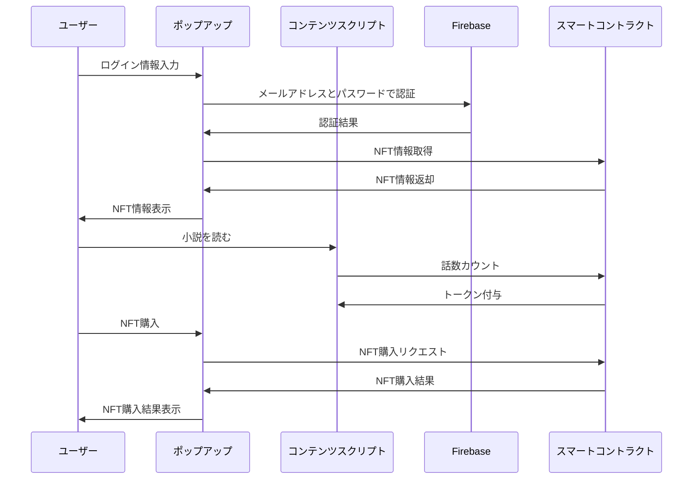

```mermaid
sequenceDiagram
  participant U as ユーザー
  participant P as ポップアップ
  participant C as コンテンツスクリプト
  participant F as Firebase
  participant S as スマートコントラクト

  U->>P: ログイン情報入力
  P->>F: メールアドレスとパスワードで認証
  F->>P: 認証結果
  P->>S: NFT情報取得
  S->>P: NFT情報返却
  P->>U: NFT情報表示
  U->>C: 小説を読む
  C->>S: 話数カウント
  S->>C: トークン付与
  U->>P: NFT購入
  P->>S: NFT購入リクエスト
  S->>P: NFT購入結果
  P->>U: NFT購入結果表示
```
