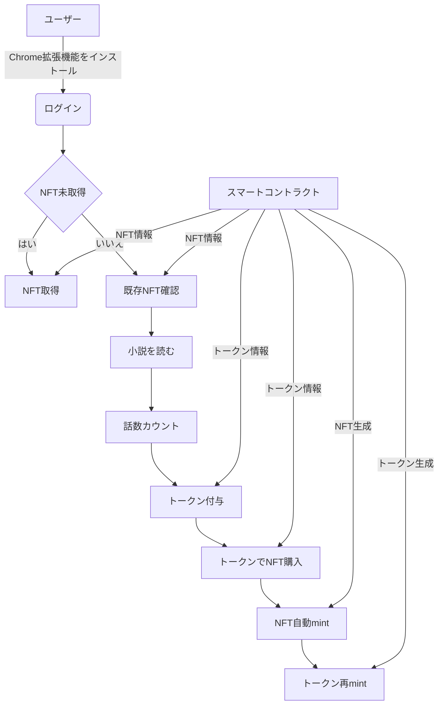

```mermaid
graph TD
  A[ユーザー] -->|Chrome拡張機能をインストール| B(ログイン)
  B --> C{NFT未取得}
  C -->|はい| D[NFT取得]
  C -->|いいえ| E[既存NFT確認]
  E --> F[小説を読む]
  F --> G[話数カウント]
  G --> H[トークン付与]
  H --> I[トークンでNFT購入]
  I --> J[NFT自動mint]
  J --> K[トークン再mint]

  L[スマートコントラクト] -->|NFT情報| D
  L -->|NFT情報| E
  L -->|トークン情報| H
  L -->|トークン情報| I
  L -->|NFT生成| J
  L -->|トークン生成| K
```
